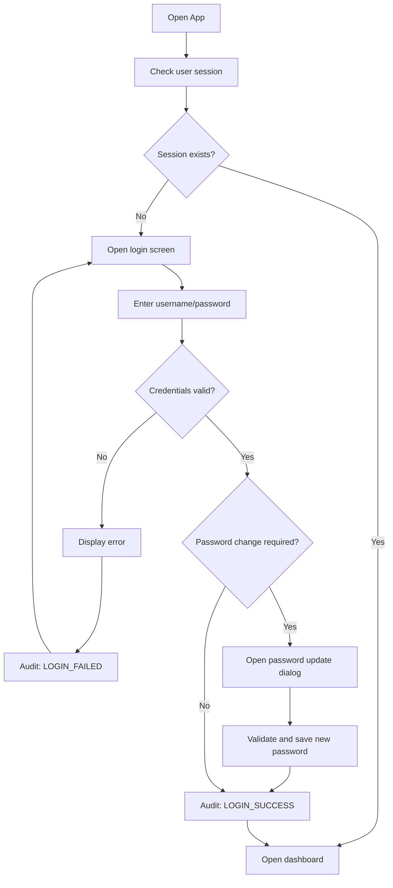
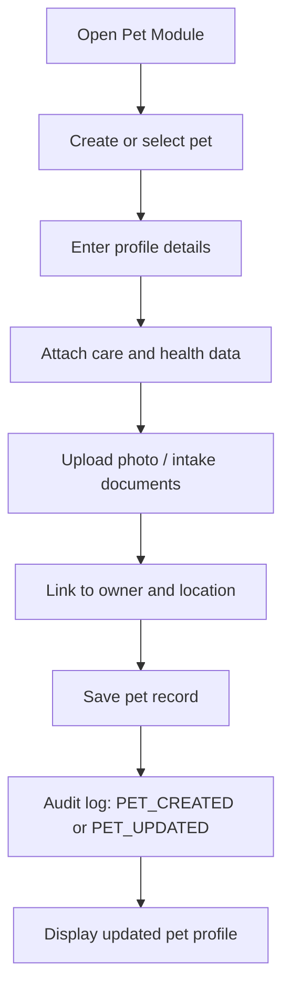
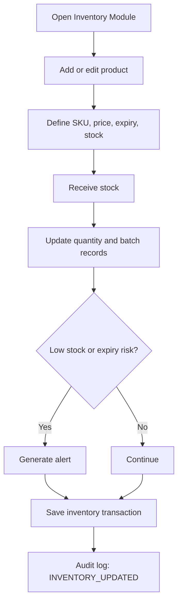
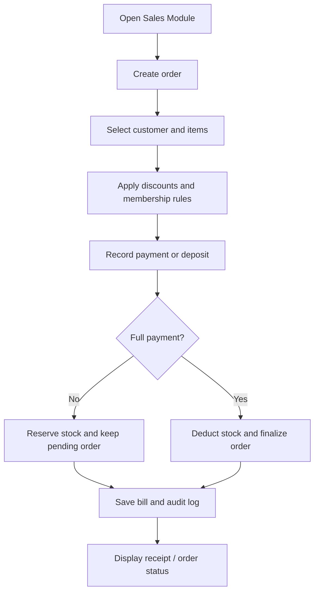
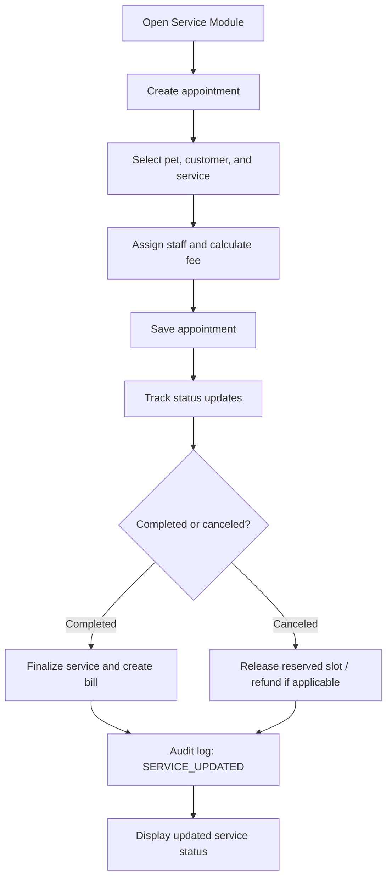
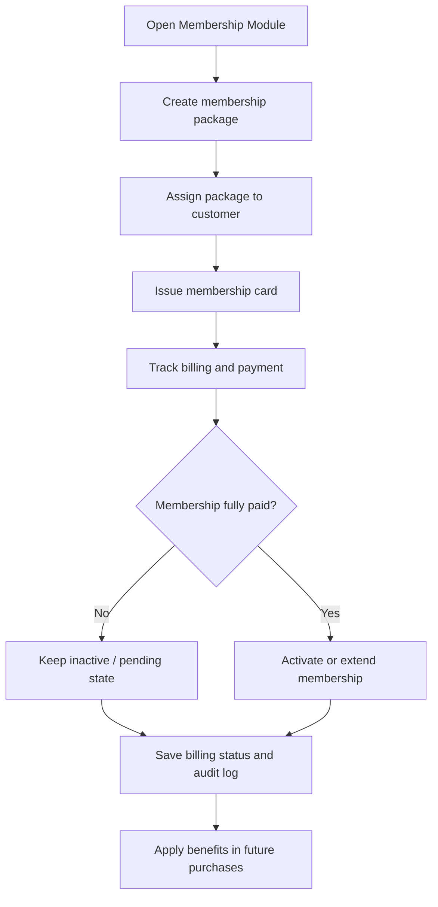
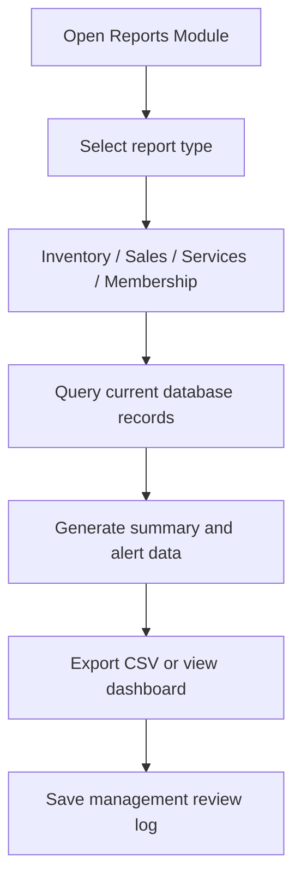

# Module-Specific Workflows

## 1. Authentication Workflow

## 2. Pet Management Workflow

## 3. Inventory Workflow

## 4. Sales Workflow

## 5. Service Workflow

## 6. Membership Workflow

## 7. Reporting Workflow

