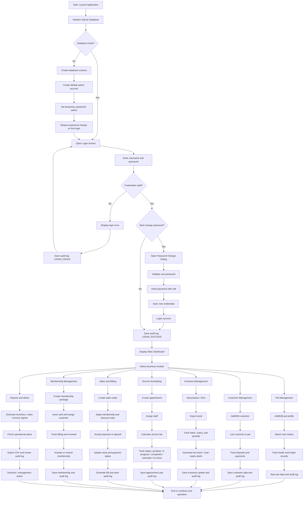

# Workflow Diagram (Mermaid)

## Workflow Summary

The application starts by creating the database and default admin account if needed. The user then logs in and is authenticated through secure password validation. After passing authentication, the user can access the dashboard and operate across main business modules such as pet management, customer records, inventory, services, sales, membership, and reporting. Every business action triggers data updates and audit logging to protect operational integrity and traceability.
