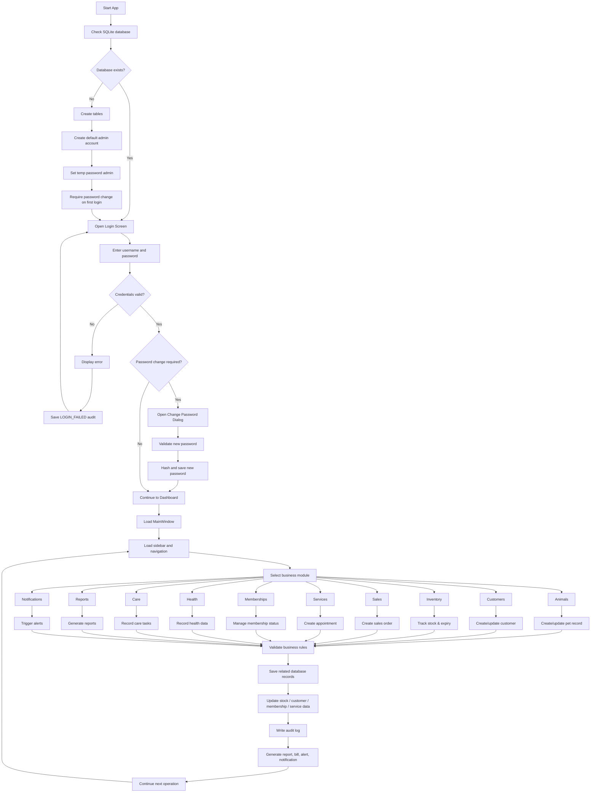

# PetCare Project Workflow — Full Logic and System Understanding

Tài liệu này mô tả logic hoạt động của dự án PetCare theo hướng chi tiết nhất, từ khi khởi động ứng dụng đến khi người dùng thực hiện các nghiệp vụ quản lý thú cưng. Mục tiêu là giúp người đọc hiểu rõ: đâu là điểm khởi đầu, dữ liệu được lưu ở đâu, ai có quyền truy cập, các module hoạt động như thế nào, và luồng nghiệp vụ thực tế diễn ra qua từng bước.

---

## 1. Tổng quan về logic dự án

PetCare là một ứng dụng quản lý cửa hàng thú cưng dạng desktop, chạy local trên máy tính, sử dụng:

- Python
- PySide6 (UI)
- SQLite (database cục bộ)
- mô-đun hóa theo từng nghiệp vụ

Về mặt logic, dự án không chỉ là một màn hình CRUD đơn thuần, mà là một hệ thống quản lý doanh nghiệp cho lĩnh vực thú cưng, gồm các dòng nghiệp vụ chính:

- Đăng nhập, phân quyền và kiểm soát truy cập
- Quản lý thú cưng
- Quản lý khách hàng
- Quản lý chuồng, sức khỏe, chăm sóc
- Quản lý hàng hóa / kho / nhập hàng
- Quản lý dịch vụ và lịch hẹn
- Quản lý đơn hàng và thanh toán
- Quản lý hội viên / membership
- Gợi ý sản phẩm
- Báo cáo và cảnh báo
- Nhật ký audit

Nói ngắn gọn: ứng dụng tiến hành từ “đăng nhập” → “đi vào dashboard” → “chọn module” → “xử lý nghiệp vụ” → “lưu vào database” → “tạo cảnh báo / báo cáo / audit log”.

---

## 2. Kiến trúc tổng thể của hệ thống

### 2.1. Lớp UI

Lớp UI do PySide6 quản lý, bao gồm:

- màn hình đăng nhập
- cửa sổ chính (`MainWindow`)
- sidebar điều hướng
- các page module: dashboard, animals, health, care, customers, sales, inventory, reports, memberships, services, etc.

### 2.2. Lớp dữ liệu

Database được khởi tạo trong `app/database.py` và gồm các repository theo từng module:

- `AuthRepository`
- `AnimalRepository`
- `CustomerRepository`
- `InventoryRepository`
- `SalesRepository`
- `MembershipRepository`
- `ServicesRepository`
- `ReportRepository`
- `NotificationRepository`
- `RecommendationRepository`
- `AuditRepository`

Mỗi repository là lớp thao tác với SQLite riêng theo chức năng.

### 2.3. Lớp nghiệp vụ

Logic thực thi nghiệp vụ nằm ở các module con trong `app/modules/...` và UI page tương ứng trong `app/ui/...`.

Ví dụ:

- `app/modules/auth` → xác thực người dùng, phân quyền
- `app/modules/inventory` → quản lý kho và tồn kho
- `app/modules/sales` → đơn hàng, thanh toán, giảm giá
- `app/modules/services` → dịch vụ, lịch hẹn, trạng thái booking
- `app/modules/recommendations` → gợi ý sản phẩm dựa trên profile thú cưng
- `app/modules/notifications` → cảnh báo hệ thống

---

## 3. Luồng khởi động ứng dụng

### Bước 1: Khởi tạo Qt application

Trong `main.py`, hàm `create_application()` tạo `QApplication` và thiết lập tên ứng dụng, style, display name.

### Bước 2: Xác định đường dẫn SQLite

`database_path()` kiểm tra biến môi trường `LOCALAPPDATA` trên Windows:

- `%LOCALAPPDATA%\PetStoreManagement\pet_store.db`

Nếu không có, sẽ fallback về thư mục `AppData\Local` hoặc `~/.local/share` trên Linux/macOS.

### Bước 3: Khởi tạo database

`Database(path)` gọi:

- `self._create_tables()` để tạo bảng dữ liệu nếu chưa có
- khởi tạo các repositories
- seed catalog dữ liệu mặc định
  - seed sự kiện bệnh và lịch tiêm
  - seed danh mục vật nuôi
  - seed sản phẩm kho
  - seed dữ liệu thức ăn / ăn uống
  - seed catalog dịch vụ

### Bước 4: Tạo admin mặc định nếu là lần đầu chạy

`setup_first_admin(database)` kiểm tra `database.user_count() == 0`.

Nếu chưa có user nào, hệ thống tự động tạo tài khoản admin mặc định:

- username: `admin`
- password: `admin`

Hệ thống hiển thị thông báo bắt buộc người dùng phải đổi mật khẩu ngay sau khi đăng nhập lần đầu.

### Bước 5: Đăng nhập

`authenticate_user(database)` mở `LoginDialog`, người dùng nhập username/password.

- nếu không hợp lệ: lưu `LOGIN_FAILED` vào audit log
- nếu hợp lệ: kiểm tra `must_change_password`
  - nếu cần đổi mật khẩu → mở `ChangePasswordDialog`
  - nếu không cần → cho vào hệ thống

### Bước 6: Mở cửa sổ chính

Nếu đăng nhập thành công, `MainWindow(database, current_user)` được tạo và `window.show()` được gọi. Đồng thời:

- `database.set_actor(user_id)`
- `database.record_audit(user_id, "LOGIN", "user", user_id)`

Vậy nên công đoạn login thực chất là “lối vào có kiểm soát và được ghi nhật ký”.

---

## 4. Luồng xác thực và bảo mật

Đây là một phần rất quan trọng trong hệ thống.

### 4.1. Mật khẩu không được lưu ở dạng plain text

Project dùng cơ chế hash password với salt, theo nguyên tắc:

- `hash_password()`
- `verify_password()`
- lưu password dạng băm + salt

Điều này giúp dữ liệu tài khoản không bị lộ nếu database bị truy cập trái phép.

### 4.2. Default admin bắt buộc đổi mật khẩu

Khi lần đầu tạo admin, mật khẩu tạm thời là `admin`. Nhưng ngay khi đăng nhập lần đầu, hệ thống buộc đổi sang mật khẩu mới. Đây là yếu tố bảo mật rất quan trọng và phù hợp với thực tế doanh nghiệp.

### 4.3. Phân quyền theo role

MainWindow có phương thức `_has_permission(permission)` để kiểm tra quyền của người dùng đang đăng nhập.

Ví dụ các nhãn quyền như:

- `users.manage`
- `audit.view`
- `dashboard.view`
- `animals.view`
- `sales.view`
- `services.view`
- `inventory.view`
- `membership.view`
- `notifications.view`

Từ đó, các chức năng trong sidebar chỉ hiện nếu người dùng có quyền tương ứng. Đây chính là logic phân quyền thực tế của hệ thống.

---

## 5. Cấu trúc cửa sổ chính và điều hướng

`MainWindow` tạo chính là “trung tâm điều phối hệ thống”.

### 5.1. Sidebar

Sidebar chứa các nhóm chức năng như:

- HỆ THỐNG
- TỔNG QUAN
- HỒ SƠ & CHĂM SÓC
- NHẬP HÀNG
- KHÁCH HÀNG & BÁN HÀNG
- VẬT TƯ & PHÂN TÍCH

### 5.2. `QStackedWidget`

Tất cả page được add vào `QStackedWidget` và chuyển qua lại bằng nút bấm. Ví dụ:

- `platform`
- `access`
- `dashboard`
- `animals`
- `pet_detail`
- `store`
- `imports`
- `health`
- `care`
- `customers`
- `customer_insights`
- `reservations`
- `sales`
- `inventory`
- `reports`
- `operations`
- `memberships`
- `services`

### 5.3. Logic điều hướng

User bấm nút nào thì `self.pages.setCurrentIndex(index)` được gọi. Đây là mô hình điều hướng đa page chuẩn của Qt, rất giống kiến trúc app desktop.

---

## 6. Luồng nghiệp vụ theo module

## 6.1. Module quản lý thú cưng (Animals)

### Mục tiêu
Quản lý hồ sơ từng con thú, gắn với các dữ liệu:

- mã thú cưng
- tên
- loài
- giống
- giới tính
- ngày sinh
- màu sắc
- cân nặng
- nguồn gốc
- status / tình trạng
- thông tin chủ nuôi

### Logic hoạt động

1. Người dùng vào `AnimalsPage`
2. Chọn thêm/sửa/xóa pet
3. Dữ liệu được lưu vào bảng `animals`
4. Pet có thể được link tới customer, care record, health record, service, appointment
5. Mỗi thao tác có thể được ghi nhật ký audit

### Ý nghĩa business

Pet là trung tâm của hệ thống. Nếu pet không có hồ sơ rõ ràng, toàn bộ hoạt động chăm sóc, bán hàng, dịch vụ đều khó kiểm soát.

---

## 6.2. Module quản lý khách hàng (Customers)

### Mục tiêu

Quản lý thông tin chủ nuôi / khách hàng, gắn với nhiều pet, nhiều dịch vụ, nhiều đơn hàng.

### Logic hoạt động

1. Tạo hoặc cập nhật customer
2. Gắn số điện thoại, địa chỉ, thông tin liên hệ
3. Gắn pet và lịch sử dịch vụ
4. Theo dõi tương tác, đơn hàng, membership, hóa đơn

### Ý nghĩa business

Khách hàng không chỉ là “đối tượng mua hàng”; họ là nguồn dữ liệu lịch sử tương tác cùng hệ thống.

---

## 6.3. Module chuồng trại / store

### Mục tiêu
Quản lý môi trường nuôi / chuồng, tình trạng phòng, không gian, khu vực lưu trữ động vật.

### Logic hoạt động

- Tạo/chỉnh sửa khu chuồng
- Gắn pet vào chuồng
- Theo dõi tình trạng sức khỏe, môi trường sống, lịch sử lưu trú

### Ý nghĩa business

Trong doanh nghiệp chăm sóc thú cưng, nơi ở, điều kiện sống và lịch sử lưu trú là yếu tố quan trọng để kiểm soát chất lượng và sức khỏe thú.

---

## 6.4. Module sức khỏe (Health)

### Mục tiêu
Quản lý bệnh lý, lịch tiêm, tình trạng sức khỏe, triệu chứng, điều trị, kế hoạch chăm sóc.

### Logic hoạt động

- Xem catalog bệnh dạng chuẩn hóa
- Gắn bệnh lý vào pet
- Ghi triệu chứng, diễn biến, điều trị
- Theo dõi lịch tiêm vaccine / schedule

### Ý nghĩa business

Hệ thống hỗ trợ quản lý sức khỏe theo hướng thao tác nghiệp vụ, không thay thế bác sĩ thú y nhưng giúp doanh nghiệp theo dõi và đưa ra quyết định bền vững.

---

## 6.5. Module chăm sóc (Care)

### Mục tiêu
Quản lý checklist chăm sóc hằng ngày.

### Logic hoạt động

- Checklist gồm nhiều mục như ăn uống, vệ sinh, vận động, giấc ngủ, thiếu nước, sức khỏe
- Người chăm sóc đánh dấu trạng thái từng mục
- Điểm dữ liệu được lưu trong database

### Ý nghĩa business

Dữ liệu chăm sóc giúp chuyển từ “ghi nhớ bằng giấy” sang “quản lý theo quy trình chuẩn”, nâng cao độ tin cậy và tính nhất quán.

---

## 6.6. Module nhập hàng / suppliers / imports

### Mục tiêu
Quản lý nhà cung cấp và nhập kho.

### Logic hoạt động

1. Tạo supplier
2. Tạo đơn nhập / import
3. Gắn sản phẩm, số lượng, giá, lô hàng, hạn sử dụng
4. Cập nhật tồn kho
5. Ghi lịch sử nhập kho

### Ý nghĩa business

Hệ thống có thể theo dõi nguồn hàng, số lượng thực tế và rủi ro tồn kho từ nhà cung cấp.

---

## 6.7. Module kho / inventory

### Mục tiêu
Quản lý vật tư, thức ăn, thuốc, đồ chơi, vật phẩm dành cho thú cưng.

### Logic hoạt động

- thêm / cập nhật product
- gắn category, số lượng, batch, expiry date
- theo dõi stock in / out
- cảnh báo low stock, near expiry
- hỗ trợ FEFO / ưu tiên hàng gần hết hạn

### Ý nghĩa business

Inventory là nơi quyết định khả năng phục vụ khách hàng, khả năng bán hàng, và ảnh hưởng trực tiếp đến lợi nhuận.

---

## 6.8. Module bán hàng / sales

### Mục tiêu

Quản lý hóa đơn, đơn hàng và thanh toán.

### Logic hoạt động

1. Chọn customer
2. Chọn pet nếu cần
3. Chọn hàng hóa / dịch vụ
4. Tính tiền, giảm giá, membership discount
5. Ghi payment status
6. Cập nhật kho
7. Lưu order và bill
8. Ghi audit log

### Quy trình nghiệp vụ đáng chú ý

- Có thể có phần thanh toán trước / đặt cọc
- Có thể có trạng thái đơn hàng chưa thanh toán / đã thanh toán / hủy
- Có thể áp dụng membership logic
- Có thể cập nhật stock khi đơn hàng được hoàn tất

### Ý nghĩa business

Sales module là nơi “tạo giá trị thương mại” cho hệ thống.

---

## 6.9. Module dịch vụ / services

### Mục tiêu

Quản lý các dịch vụ chăm sóc thú cưng và lịch hẹn.

### Logic hoạt động

- tạo service catalog
- tạo appointment cho pet / customer
- phân công nhân viên
- tính giá dịch vụ dự kiến
- theo dõi trạng thái: received, in progress, completed, cancelled, no-show
- lưu lịch sử gắn với pet và customer

### Ý nghĩa business

Dịch vụ là phần tạo ra trải nghiệm và giữ chân khách hàng. Hệ thống giúp chuyển lịch hẹn rời rạc thành quy trình quản lý rõ ràng.

---

## 6.10. Module hội viên / memberships

### Mục tiêu

Quản lý gói thành viên, quyền lợi, hóa đơn membership, gia hạn và ưu đãi.

### Logic hoạt động

- tạo membership package
- gắn với khách hàng
- duy trì trạng thái active / expired / pending
- hướng dẫn tính phí và gia hạn
- áp dụng ưu đãi trong dịch vụ và bán hàng

### Ý nghĩa business

Membership tăng khả năng giữ chân khách hàng và thúc đẩy doanh thu dài hạn.

---

## 6.11. Module báo cáo / reports

### Mục tiêu

Biến dữ liệu thành thông tin quản trị.

### Logic hoạt động

- đọc dữ liệu từ sở dữ liệu
- tổng hợp theo module: kho, bán hàng, dịch vụ, khách hàng
- hiển thị trên dashboard hoặc report screen
- xuất CSV / báo cáo quản lý

### Ý nghĩa business

Nếu không có report, ứng dụng chỉ là nơi ghi dữ liệu. Báo cáo giúp người quản lý biết “Điều gì đang xảy ra?” và “Cần làm gì tiếp theo?”

---

## 6.12. Module cảnh báo / notifications / operations

### Mục tiêu

Phát hiện rủi ro hoạt động, cảnh báo tới người dùng.

### Logic hoạt động

- low stock
- near expiry
- pending appointments
- payment due
- audit event / login thất bại
- member status risk

### Ý nghĩa business

Cảnh báo giúp doanh nghiệp phản ứng kịp thời chứ không chờ đến khi sự cố lớn hơn.

---

## 7. Luồng dữ liệu và mối quan hệ giữa các module

Một điểm quan trọng của hệ thống là các module không tách rời nhau, mà liên kết với nhau theo dữ liệu thực tế.

### Ví dụ 1: Khách hàng mua thức ăn cho chó

1. Khách hàng được tạo trong `customers`
2. Pet được tạo trong `animals`
3. Customer gắn với pet
4. Kho có product thức ăn
5. Sales tạo đơn hàng
6. Inventory giảm số lượng sản phẩm
7. Membership / discount có thể áp dụng nếu khách hàng là hội viên
8. Audit log ghi lại thao tác
9. Reports tổng hợp doanh thu và tồn kho

### Ví dụ 2: Khách hàng đặt lịch chăm sóc thú cưng

1. Customer và pet tồn tại
2. Services tạo appointment
3. Staff được phân công
4. Care / health record theo dõi trạng thái chăm sóc
5. Sau khi hoàn tất, thay đổi service status
6. Báo cáo hiển thị tỷ lệ hoàn thành dịch vụ

### Ví dụ 3: Quản lý ít hàng và sai hạn sử dụng

1. Inventory theo dõi sản phẩm
2. Hệ thống phát hiện gần hết hàng hoặc gần hết hạn
3. Notification cảnh báo người quản lý
4. Người quản lý quyết định nhập thêm hoặc discount sản phẩm
5. Audit log lưu ý định hướng hành động

---

## 8. Logic recommendation engine (gợi ý sản phẩm)

Một tính năng nổi bật của dự án là recommendation engine. Đây là logic gợi ý dựa trên dữ liệu thực tế của thú cưng và kho hàng, chứ không phải AI ngoài trời.

### Logic cơ bản

- xem profile pet: loài, tuổi, tình trạng sức khỏe, nhu cầu dinh dưỡng
- xem catalog sản phẩm / thức ăn / thuốc / vật dụng
- xem dữ liệu tương tác trước đó
- chọn sản phẩm phù hợp theo tiêu chí: loài, nhu cầu, giá, ngân sách, mức độ ưu tiên
- sắp xếp theo ranking / score
- hiển thị giải thích vì sao sản phẩm được gợi ý

### Mục tiêu

- hỗ trợ nhân viên gợi ý sản phẩm phù hợp
- giảm thời gian chọn hàng cho khách
- tăng tỷ lệ bán / upsell
- xây dựng hệ thống đề xuất offline, không cần cloud service

### Công thức kiểu logic

- ưu tiên sản phẩm theo loài
- ưu tiên sản phẩm theo mục tiêu chăm sóc sức khỏe
- ưu tiên sản phẩm theo ngân sách khách hàng
- ưu tiên sản phẩm có lượt tương tác tốt
- chặn các sản phẩm không phù hợp với pet

---

## 9. Logic báo cáo và cảnh báo

### 9.1 Báo cáo

Reports đọc dữ liệu đã được cập nhật từ nhiều module và tổng hợp thành báo cáo quản trị:

- inventory report
- sales report
- service report
- membership report
- customer activity report

### 9.2 Cảnh báo

Các cảnh báo chủ yếu xuất hiện khi trạng thái vượt ngưỡng hoạt động:

- tồn kho thấp
- hàng sắp hết hạn
- khách hàng membership sắp hết hạn
- lịch hẹn chưa xử lý
- người dùng đăng nhập sai mật khẩu

### 9.3 Dữ liệu phản hồi

Hệ thống có thể ghi lại các sự kiện để tương tác lại sau này. Ví dụ:

- pet có lịch sử bệnh
- khách hàng có lịch sử order
- staff biết lịch sử dịch vụ của thú cưng

Điều này giúp quản lý tốt hơn các quyết định trong tương lai.

---

## 10. Logic audit và khả năng truy vết

Audit là một phần cực kỳ quan trọng vì hệ thống hoạt động trong môi trường quản lý thực tế.

### Audit log lưu thông tin gì?

- user_id
- action type
- entity type
- timestamp
- details
- actor

### Ví dụ

- `LOGIN`
- `LOGIN_FAILED`
- `PASSWORD_CHANGED`
- `ANIMAL_CREATED`
- `INVENTORY_UPDATED`
- `SALE_COMPLETED`
- `SERVICE_STATUS_CHANGED`
- `MEMBERSHIP_RENEWED`

### Mục tiêu

- truy vết người thao tác
- kiểm tra dữ liệu bất thường
- gỡ lỗi nghiệp vụ
- hỗ trợ bảo mật và governance

---

## 11. Luồng thực tế từ đầu đến cuối trong ứng dụng

Dưới đây là luồng logic tổng quát của dự án:

```text
Start app
  -> kiểm tra database
  -> nếu chưa có -> tạo schema + admin mặc định
  -> nếu có -> mở login screen

Login
  -> validate username/password
  -> verify password hash
  -> nếu sai -> lưu LOGIN_FAILED
  -> nếu đúng -> check must_change_password
  -> nếu cần -> đổi mật khẩu mới

MainWindow
  -> load sidebar
  -> load dashboard
  -> user chọn module

Module actions
  -> thêm/sửa/xóa dữ liệu theo nghiệp vụ
  -> validate rules
  -> update database
  -> update related tables
  -> tạo notification nếu cần
  -> ghi audit log

Reports / Alerts
  -> tổng hợp dữ liệu
  -> hiển thị dashboard và báo cáo
  -> có thể export CSV

End session
  -> logout / close app
  -> đóng giao dịch / giữ dữ liệu local
```

---

## 12. Mermaid workflow hoàn chỉnh



---

## 13. Tại sao logic này là “logic thực sự” của dự án?

Vì trong PetCare, mỗi module đều gắn với một nhiệm vụ doanh nghiệp rõ ràng:

- Pet module: quản lý thú cưng
- Customer module: quản lý khách hàng và mối quan hệ
- Inventory module: kiểm soát hàng hóa
- Sales module: tạo doanh thu
- Services module: hoạt động chăm sóc / lịch hẹn
- Membership: giữ chân khách hàng
- Reports: đưa ra thông tin cho quyết định
- Audit: bảo vệ dữ liệu và trách nhiệm

Đây không phải là một hệ thống “vẽ giao diện rồi cố thêm dữ liệu”. Đây là một hệ thống quản lý theo đúng logic của doanh nghiệp pet care.

---

## 14. Kết luận

Logic tổng thể của dự án PetCare có thể hiểu đơn giản như sau:

- Khởi động ứng dụng
- Tạo / mở database
- Đăng nhập và xác thực người dùng
- Vào dashboard
- Chọn chức năng nghiệp vụ
- Kiểm tra dữ liệu và quy tắc nghiệp vụ
- Cập nhật dữ liệu vào SQLite
- Ghi nhật ký audit
- Tạo báo cáo, cảnh báo hoặc hóa đơn
- Tiếp tục chu kỳ quản lý cho các hoạt động sau

Đây là một chu trình hoạt động hoàn chỉnh và thực tế cho một hệ thống quản lý pet store / pet care. Nó phù hợp với mục tiêu mô tả dự án như một sản phẩm phần mềm thực tế, không chỉ là demo kỹ thuật.

---

## 15. Tóm tắt 1 câu

PetCare vận hành theo chu trình: login → dashboard → chọn module → validate nghiệp vụ → lưu database → ghi audit → tạo báo cáo/cảnh báo → tiếp tục hoạt động quản lý.
