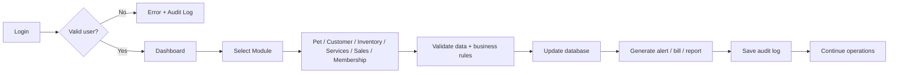

# Short Workflow for a One-Slide Presentation

## 1. Overview

This document summarizes the PetCare system workflow in a compact form that is suitable for a single-slide presentation or a quick executive summary. It captures the core operational cycle without diving into excessive technical detail, while still communicating the real business logic of the system.

The workflow is built around the same design principle as the full project: users authenticate, the dashboard loads, the user chooses a module, data is validated and processed, the database is updated, and output is generated in the form of alerts, reports, or bills. This simple sequence is the operational foundation of the application.

## 2. One-Slide Workflow

## 3. Presentation Interpretation

This diagram expresses the complete operating cycle of the system in a simple and easy-to-understand structure. It shows that the application is not just a static form collection; it is a working operational system that responds to real business events.

The process begins when a user logs in. If the user is valid, the main dashboard appears. From there, the user selects the relevant module, for example pet management, inventory, sales, services, or membership. The system validates the entered data and business status, updates the database, and then produces the necessary operational response, such as a bill, stock warning, or report. Finally, the action is recorded in the audit log to ensure accountability and traceability.

## 4. Why This Diagram Works

This representation works well in presentations because it is short, readable, and business-oriented. It does not overcomplicate the process with technical implementation details. Instead, it communicates the practical logic of the application and explains how PetCare supports day-to-day operations in a pet business setting.

In a project defense, this slide helps the audience understand the life cycle of the system quickly. They can see that the platform is designed around actual operational behavior rather than hypothetical use cases. This makes the system easier to understand and easier to defend.

## 5. Best Speaker Note for This Slide

“PetCare operates through a simple but effective cycle: login, dashboard access, module-based work, business rule validation, database update, and report or alert generation. This workflow reflects real pet business operations and ensures that every important action is recorded and traceable.”

## 6. Summary Statement

This one-slide workflow is a concise representation of what the project does: it empowers a pet business to manage operations in a structured, secure, and traceable way from login to final reporting.
