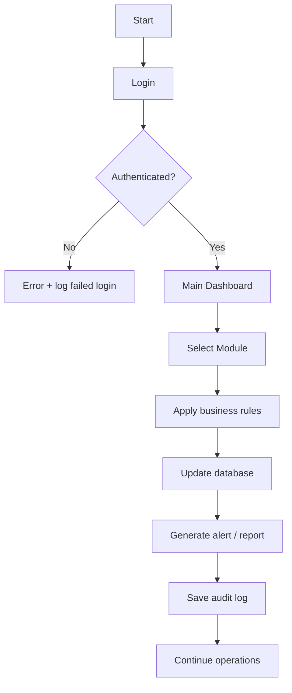

# Report Template: System Design, Workflow, Security, and Functions

## I. Overview

[Provide a short summary of the project and its purpose.]

## II. System Design

### 2.1 System Architecture
- UI Layer
- Business Logic Layer
- Data Access Layer
- Security Layer

### 2.2 Main Modules
- Authentication
- Pet Management
- Inventory
- Sales
- Services
- Memberships
- Reports
- Audit Logging

### 2.3 Functional Scope
- [Function 1]
- [Function 2]
- [Function 3]
- [Function 4]

## III. Workflow

### 3.1 High-Level Workflow

### 3.2 Process Narrative
[Describe the workflow in detailed business process form.]

## IV. Security

### 4.1 Authentication Security
- Password hashing
- Salted storage
- Mandatory first-login password change

### 4.2 Authorization
- Role-based access control
- Restricted admin modules

### 4.3 Audit and Traceability
- Login audit
- Transaction audit log
- Administrative action records

### 4.4 Data Protection
- Local storage
- Backup recommendation
- Restrict file access

## V. Conclusion

[Provide final system evaluation and summary of business value, benefits, and future improvements.]
