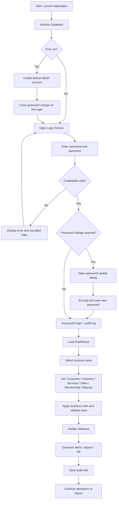
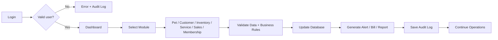

# System Design + Workflow + Security + Functions

## I. Overview

PetCare is a local desktop management system designed for pet stores, grooming centers, and animal care businesses. The system integrates key business workflows into a single environment and supports daily operations such as pet management, customer tracking, inventory control, sales processing, service scheduling, membership management, reporting, and audit monitoring.

The core objective is to provide a practical, secure, and cost-effective internal operating system that can be used without requiring a complex cloud architecture or external backend infrastructure. The system stores data in SQLite and runs locally on the Windows desktop environment, making it suitable for small and medium-sized pet businesses.

## II. System Design

### 2.1 Architecture

The application is designed using a modular layered architecture:

- UI layer: built with PySide6 and used for interaction between staff and the system
- Business logic layer: contains functional modules such as auth, pet, health, sales, services, inventory, memberships, recommendations, and reporting
- Data access layer: managed through SQLite database files and repository logic
- Security layer: includes authentication, password hashing, access control, and audit logging

### 2.2 Main Modules

- Authentication module
- Pet management module
- Care and health module
- Customer management module
- Inventory management module
- Sales and billing module
- Service scheduling module
- Membership management module
- Recommendation module
- Reporting and alerts module
- Audit log module

### 2.3 Core Functionalities

- Manage pet profiles and intake records
- Track health and care activities
- Manage customer history and relationships
- Process stock in/out and FEFO-based inventory logic
- Create sales orders and handle partial payment
- Manage service bookings and payment states
- Manage membership packages, cards, and billing
- Generate operational reports and alerts
- Support offline recommendation suggestions for products and combo strategies

## III. Workflow

### 3.1 High-Level Workflow

### 3.2 Detailed Functional Workflow

#### Pet workflow
- User creates pet profile
- Enters identity, age, species, health data, and housing details
- Saves the record to the database
- Links customer and care records
- Generates audit history

#### Customer workflow
- User creates or updates customer details
- Links pets and transactions
- Records deposits, payments, and obligations
- Saves relationship-based customer history

#### Inventory workflow
- User adds or updates product records
- Imports stock and records batch/expiry data
- Checks inventory level and expiry risk
- Triggers alerts for low stock or near-expiry products

#### Sales workflow
- User creates sales order
- Applies discounts or membership rules
- Records payment or deposit
- Updates stock and final order status
- Generates bill and audit log

#### Service workflow
- User creates appointment
- Selects pet, service, staff, and time slot
- Calculates price and tracks status changes
- Updates service completion or cancellation status
- Saves service history and invoice data

#### Membership workflow
- User creates membership package
- Issues card to customer
- Tracks renewal and payment records
- Activates membership after billing is complete
- Applies membership benefits in future service or sales transactions

#### Reporting workflow
- User selects report type
- Data is queried from the database
- Reports are generated for inventory, sales, membership, and service activity
- CSV export and alerts are produced for management review

## IV. Security

### 4.1 Authentication Security

- Passwords are not stored in plain text
- The system uses PBKDF2-HMAC-SHA256 password hashing
- A random salt is generated per user
- The default admin account must change its password after first login
- Failed login attempts are logged in audit records

### 4.2 Authorization and Access Control

- Different user roles can access different modules
- Administrative operations are restricted to authorized users
- Sensitive functions such as account management require proper privileges
- Business functions are controlled through role-based access checks

### 4.3 Audit and Traceability

- All major actions are written to the audit log
- Examples include login activity, password changes, product updates, sales, and service status changes
- Audit trails support investigation, accountability, and operational monitoring

### 4.4 Data Protection and Business Security

- Local SQLite storage keeps operational data within the local system environment
- Backup of the database is strongly recommended
- Access to the machine and database folder should be restricted
- The system is designed for internal business use and should run on secured devices

### 4.5 Security Limitations

- No multi-factor authentication is currently implemented
- No external identity provider or OAuth integration is available
- Local deployment requires physical or user-level security measures
- The system is not a public-facing online platform

## V. Conclusion

PetCare is a practical and modular desktop management system for pet stores and animal care businesses. It combines pet management, customer records, stock control, sales, services, membership tracking, and reporting into a single local platform. The system is designed to improve operational efficiency, support business decision-making, and maintain a secure record of internal business activity.

The design is especially suitable for small and medium-sized businesses that need a low-cost, local-first, and easy-to-maintain solution without the complexity of a cloud-hosted enterprise system. As the project evolves, it can be expanded with richer analytics, deeper reporting, smarter recommendations, and stronger integrations while preserving the same core operational model.

## Short Workflow (One-Slide Version)

