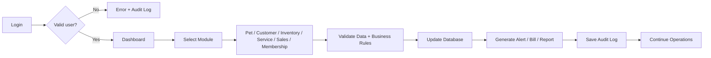

# Short Workflow for One Slide

## Presentation note
This one-slide workflow summarizes the operational cycle of the system: authentication → main dashboard → business module → validation → database update → alerts/reporting → audit trail.
